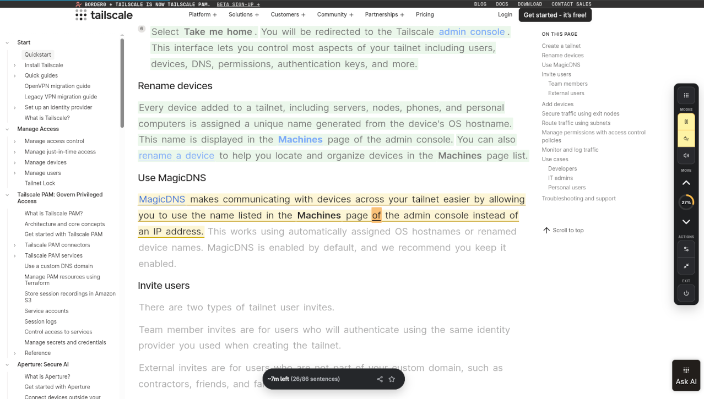

# Web Reader

Web Reader makes long articles easier to read. It keeps you focused sentence by sentence, offers a distraction-free Rapid Serial Visual Presentation (RSVP) view, remembers your progress, and can read the remaining content aloud.

## Features

- Highlights one sentence at a time to keep your focus.
- Tracks read and unread sentences for each page.
- Restores your reading progress when you return to a page.
- Supports Guided Reading with word-level focus and automatic advancement.
- Includes a Rapid Serial Visual Presentation (RSVP) view for distraction-free, word-by-word reading.
- Reads the current sentence and remaining unread sentences aloud.
- Works with pages that update their content without a full reload.
- Includes touch-friendly controls for mobile browsers.
- Lets you continue an article on another device with a progress link or QR code.

## How To Use

1. Open a long-form article or other page you want to read.
2. Open the Web Reader toolbar popup, right-click the page, or press `Alt+Shift+L` (`Command+Shift+L` on macOS).
3. Select **Enable Reading Mode**.
4. Use the controls on the page to navigate through the content.

The extension is disabled by default and must be enabled separately for each page. You can also enable or disable it from the page's right-click menu.

## Controls

- **Previous** and **Next** move between sentences.
- **Guide** starts or stops Guided Reading.
- **Read Aloud** reads the current sentence and continues through the remaining unread content.
- **Reset** clears the saved reading progress for the page.
- **Exit** disables reading mode for the page.

Keyboard shortcuts are available on desktop. On touch devices, use the control dock at the bottom of the page.

## Reading History

Reading history is optional. Choose **Keep Reading History** in the popup to resume articles, see reading and listening time, and save favorites. Reading progress stays in local extension storage. Browser-syncable settings and per-site preferences may use your browser's sync storage when it is enabled.

## Continue On Another Device

Use the share button in the reader controls to copy a continuation link or scan its QR code. The link includes the article URL and your reading position in its fragment, so share it only with people or devices you trust. Web Reader must be installed on the receiving browser to restore the saved position.

## Browser Support

Firefox 128 or later is the primary supported browser. Chrome is also supported. Read Aloud requires a browser-provided compatible voice, so availability may vary by browser and device.
